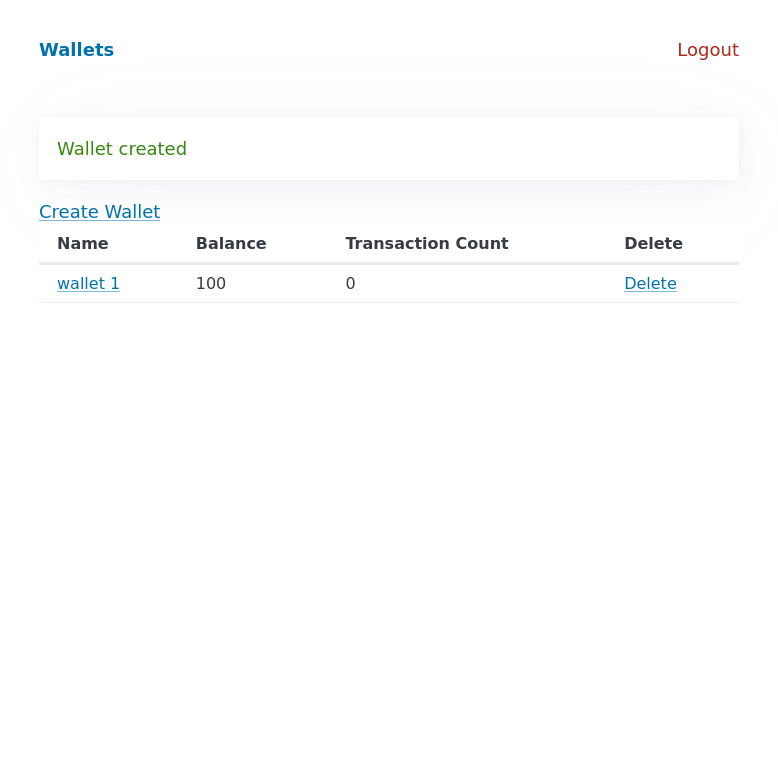

# virtual-wallet

Application for making virtual wallets. Built with Laravel

## Requirements

- PHP 7.4
- MySQL (tested on 8.0.35) or SQLite

## Install

clone repository

```bash
$ git clone https://github.com/MikusR/virtual-wallet.git
```

use Composer to get dependencies

```bash
$ composer install
```

copy .env.example to .env
and configure access to database
for example:

```ini
DB_CONNECTION = sqlite
DB_HOST = 127.0.0.1
DB_PORT = 3306
```

If using sqlite

```bash
touch database/database.sqlite
```

make fresh database (auto creates seed wallet)

```bash
php artisan migrate:fresh
```

run

```bash
php artisan serve
```

## tests

Currently only log-in functionality

```bash
php artisan test
```

```bash
   PASS  Tests\Unit\ExampleTest
  ✓ example

   PASS  Tests\Feature\ExampleTest
  ✓ example

   PASS  Tests\Feature\LoginTest
  ✓ user can view a login form
  ✓ user can view a register form
  ✓ user cannot view a login form when authenticated
  ✓ user cannot view a register form when authenticated
  ✓ user can log out when authenticated
  ✓ user can not log in with wrong credentials
  ✓ user can login with correct credentials

   PASS  Tests\Feature\WalletTest
  ✓ example

  Tests:  10 passed
  Time:   0.55s
```

## user stories

As a User, I can sign up for a User account, so that I can access the application.


As a User, I can login to my account.


As a User, I can logout of my account.


As a User, I can create a virtual Wallet.


As a User, I can view a list of my virtual Wallet.



As a User, I can rename my virtual Wallet.


As a User, I can delete a virtual Wallet.


As a User, I can add a Transaction to a virtual Wallet.


As a User, I can see all the Transactions in my virtual Wallet.


As a User, I can delete Transaction from a virtual Wallet.


As a User, I can mark Transaction as Fraudulent.


As a User, I see total sum of Transactions in virtual Wallet separated in incoming and outgoing transactions.


