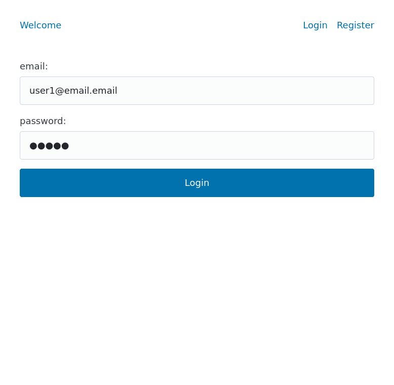
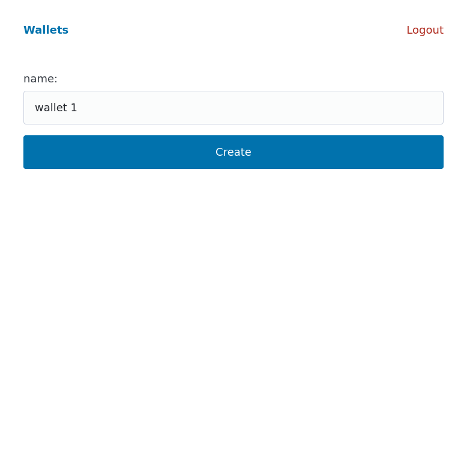

# virtual-wallet

Application for making virtual wallets

## user stories

As a User, I can sign up for a User account, so that I can access the application.

As a User, I can login to my account.

As a User, I can logout of my account.

As a User, I can create a virtual Wallet.

As a User, I can view a list of my virtual Wallet.

As a User, I can rename my virtual Wallet.

As a User, I can delete a virtual Wallet.

As a User, I can add a Transaction to a virtual Wallet.

As a User, I can see all the Transactions in my virtual Wallet.

As a User, I can delete Transaction from a virtual Wallet.

As a User, I can mark Transaction as Fraudulent.

As a User, I see total sum of Transactions in virtual Wallet separated in incoming and outgoing transactions.

