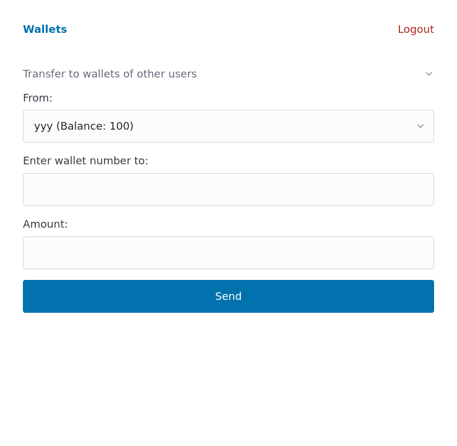

# Changelog

## 2024-02-27

If user has multiple wallets, they show up in a combobox with balance. Only show if balance > 0

If user has only single wallet then show only option to transfer to wallets of other users

If user has multiple wallets, then show also the option to transfer between own wallets

